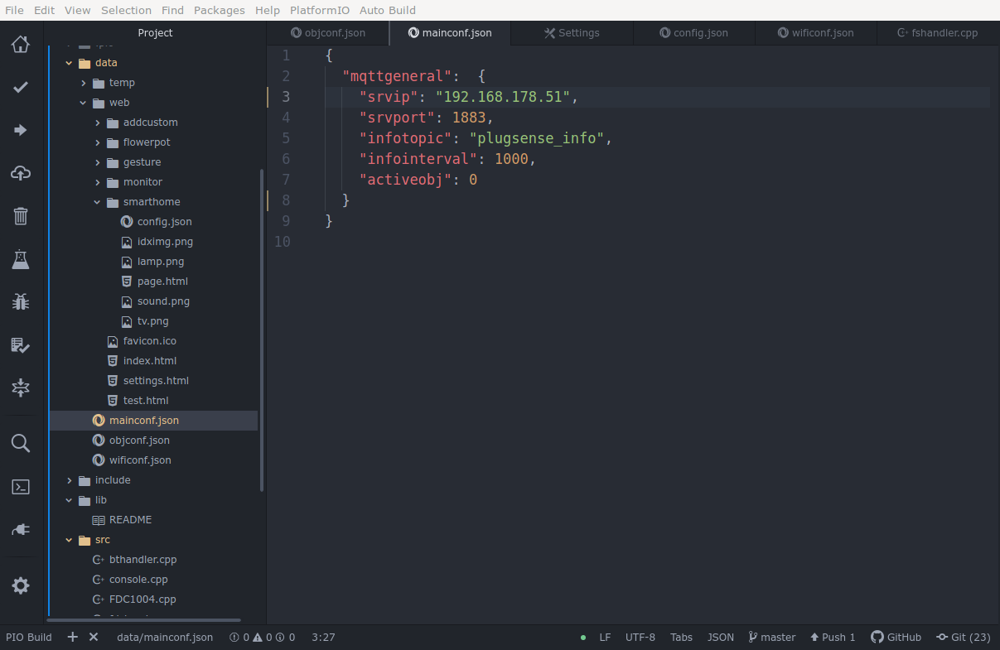
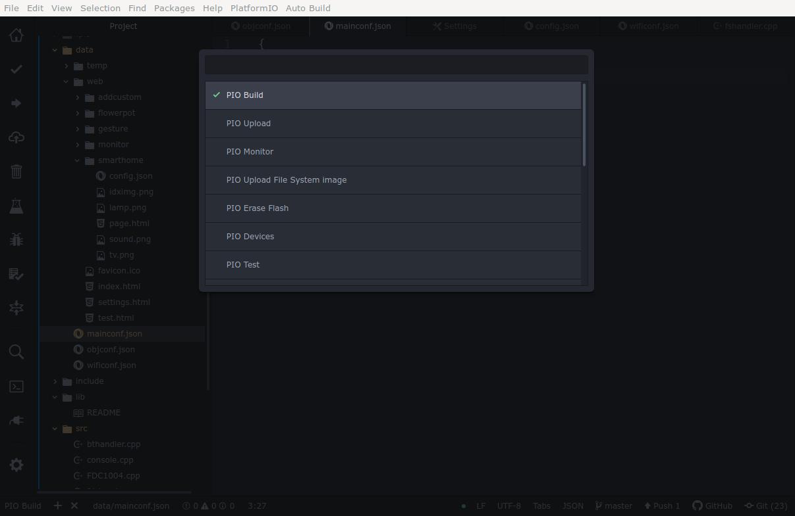

# Firmware

## Compile & Flash
- Install VSCode and PlatformIO
- Build the firmware and upload it to the (USB connected) devices

##  Flash DATA section

- PIO Build (or similar)
- „PIO Upload File System Image“

DATA section contains web and configuration files. This operation builds a DATA object from everything in the „data“ folder and transfers it to the memory.

